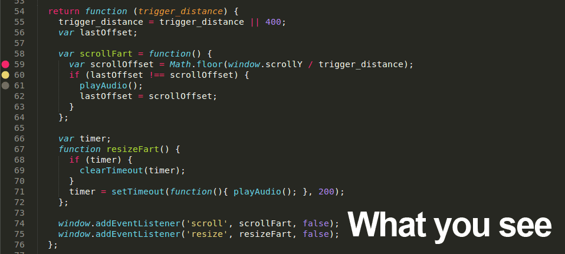

Summary
---------
Debugging javascript can be tedious due to the lack of integration between the code editor and the browsers' debugging tools. JsDebuggr aims to make it a tad easier by allowing the user to easily manage breakpoints from the Sublime Text editor.  

The way JsDebuggr works is by inserting the `debugger` keyword at each breakpoint when the document is saved. Since this happens only when the document is saved, the user never sees the breakpoints. They just work :D

Open your breakpoint'd code in your favorite browser (*cough* Chrome *cough*), open your browser's dev tools, and see your breakpoints workin'!

Features
--------
* Add, remove, enable, and disable individual breakpoints
* Remove, enable, and disable all breakpoints to make cleanup after a sweaty debug session a snap.
* Conditional breakpoints
* Breakpoints stay in your code and are reloaded next time you open it
* Breakpoints stick to the line you want them on, so pre-processing your code and refreshing the page doesn't mess up your stuff.

What This Isn't
---------------
This plugin is not a developer console replacement. You will still need to open firebug or chrome dev tools or enable debugging in node.js, and use those tools to examine the stack, vars, etc. This plugin doesn't connect to those dev tools in any way, it just makes managing breakpoints a lot more sane.

Installation
------------
From Sublime Text 3, assuming Package Control is installed, press `ctrl+shift+p` (Win, Linux) or `cmd+shift+p` (OS X) and start typing "Install Package". Select "Package Control: Install Package" from the list, then start typing "jsdebuggr", and select the package to install.  

Usage
-----
Simply add a breakpoint and then *save the document*. This will add the `debugger` keywords behind the scenes, so when your document is loaded in a js engine that supports it, it will break at that point. Note that you *must save the document* after adding, removing, or editing breakpoints to make the changes stick!

The default key bindings are as follows:

* `ctrl + f10` - add or remove breakpoint
* `ctrl + shift + f10` - disable or enable breakpoint
* `alt + f10` - add a conditional breakpoint

Additionally, the right click menu allows for:

* add/remove breakpoint
* edit conditional breakpoint
* enable/disable breakpoint
* enable/disable all
* remove all

TODO
---------
* more efficient is enabled checks for commands
	* dont load anything if the syntax isnt supported
	* dont check specific line scope for every option in the right click menu
* click gutter to add breakpoint?
* right click gutter to edit breakpoint?
* store debugger text region, then delete after save (instead of regex)
* can probably get rid of debuggerRe field on language def
* more languages (coffeescript, python?, others?)
* show conditional as phantom?
* add some sorta global breakpoint disable in js-land so users can disable breakpoints in their debugger
* multiple selection support
* config option to completely disable
* config option to toggle debug logging
* logpoints?
* tests!